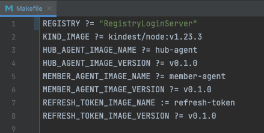
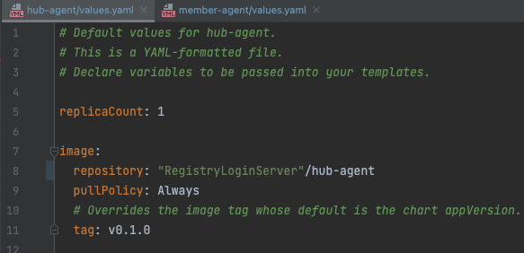
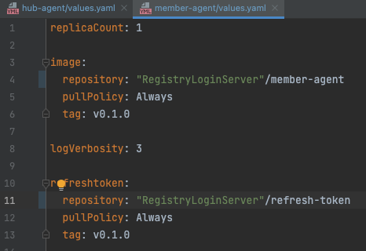

# Fleet

![GitHub release (latest by date)][1]
[![Go Report Card][2]][3]
![Build Status][4]
![GitHub go.mod Go version][5]
[![codecov][6]][7]

Fleet Join/Leave is a feature that allows a member cluster to join and leave a fleet(Hub) in the fleet control plane.

## Quick Start

**This guide has two parts,**

1. Steps to run agents on Kind clusters
2. Steps to run agents on AKS clusters

**For the kind clusters everything needed to run the agents is already predefined in the makefile no changes are needed. But for the AKS cluster we need to make some changes to files within the fleet repo.**

---

### Prerequisites

- [Docker](https://docs.docker.com/get-docker/)
- [Helm](https://github.com/helm/helm#install) version 3.6+
- [Go](https://golang.org/) version v1.17
- [kubectl](https://kubernetes.io/docs/tasks/tools/install-kubectl/) version v1.22
- [kind](https://kind.sigs.k8s.io/) version v0.12.0

## Steps to run agents on Kind clusters

**1. Clone the repo to your machine**

```shell
$ git clone https://github.com/Azure/fleet
```

**2. Navigate to fleet directory**

```shell
$ cd fleet
```

**3. Set up `hub` and `member` kind clusters**

The makefile uses **kindest/node:v1.23.3** if your version is higher/lower use the following command to pull the image for v1.23.3

```shell
$ docker pull kindest/node:v1.23.3
```

then run,

```shell
$ make create-hub-kind-cluster create-member-kind-cluster
```

**4. Build and load images to kind clusters** (since we are testing locally we don't have access to [fleet packages](https://github.com/orgs/Azure/packages?repo_name=fleet))

```shell
 $ OUTPUT_TYPE=type=docker make docker-build-hub-agent docker-build-member-agent docker-build-refresh-token
 $ make load-hub-docker-image load-member-docker-image
```

**5. Install hub and member agents helm charts**

```shell
$ make install-member-agent-helm
```

**6. Apply `memberCluster` to the hub cluster**

```shell
$ kind export kubeconfig --name hub-testing
$ kubectl apply -f examples/fleet_v1alpha1_membercluster.yaml 
```

**7. Check to make sure the `memberCluster` & `internalMemberCluster` resources status have been updated to 'Joined'**

```shell
$ kubectl describe membercluster kind-member-testing
 ```

<details>
<summary>Result</summary>

```shell
Name:         kind-member-testing
Namespace:    
Labels:       <none>
Annotations:  <none>
API Version:  fleet.azure.com/v1alpha1
Kind:         MemberCluster
Metadata:
  Creation Timestamp:  2022-07-08T01:42:35Z
  Generation:          1
  Resource Version:  868
  UID:               67cec7a4-3386-4fd5-9de2-20397e7b0029
Spec:
  Identity:
    API Group:             
    Kind:                  ServiceAccount
    Name:                  member-agent-sa
    Namespace:             fleet-system
  Lease Duration Seconds:  30
  State:                   Join
Status:
  Allocatable:
    Cpu:     8
    Memory:  2032532Ki
  Capacity:
    Cpu:     8
    Memory:  2032532Ki
  Conditions:
    Last Transition Time:  2022-07-08T01:42:36Z
    Message:               
    Observed Generation:   1
    Reason:                InternalMemberClusterHeartbeatReceived
    Status:                True
    Type:                  HeartbeatReceived
    Last Transition Time:  2022-07-08T01:42:36Z
    Message:               
    Observed Generation:   1
    Reason:                MemberClusterJoined
    Status:                True
    Type:                  Joined
Events:
  Type    Reason                        Age   From           Message
  ----    ------                        ----  ----           -------
  Normal  NamespaceCreated              81s   memberCluster  Namespace was created
  Normal  InternalMemberClusterCreated  81s   memberCluster  Internal member cluster was created
  Normal  RoleCreated                   81s   memberCluster  role was created
  Normal  RoleBindingCreated            81s   memberCluster  role binding was created
  Normal  MemberClusterJoined           81s   memberCluster  member cluster is joined

```
</details><br/>

```shell
$ kubectl describe internalmembercluster kind-member-testing -n fleet-kind-member-testing
```

<details>
<summary>Result</summary>

```shell
Name:         kind-member-testing
Namespace:    fleet-kind-member-testing
API Version:  fleet.azure.com/v1alpha1
Kind:         InternalMemberCluster
Metadata:
  Creation Timestamp:  2022-07-08T01:42:36Z
  Generation:          1
  Owner References:
    API Version:     fleet.azure.com/v1alpha1
    Controller:      true
    Kind:            MemberCluster
    Name:            kind-member-testing
    UID:             67cec7a4-3386-4fd5-9de2-20397e7b0029
  Resource Version:  865
  UID:               1b544873-81b8-4bac-9624-d4208aa21fd1
Spec:
  Lease Duration Seconds:  60
  State:                   Join
Status:
  Allocatable:
    Cpu:     8
    Memory:  2032532Ki
  Capacity:
    Cpu:     8
    Memory:  2032532Ki
  Conditions:
    Last Transition Time:  2022-07-08T01:42:36Z
    Message:               
    Observed Generation:   1
    Reason:                InternalMemberClusterHeartbeatReceived
    Status:                True
    Type:                  HeartbeatReceived
    Last Transition Time:  2022-07-08T01:42:36Z
    Message:               
    Reason:                ReconcileSuccess
    Status:                True
    Type:                  Synced
    Last Transition Time:  2022-07-08T01:42:36Z
    Message:               
    Observed Generation:   1
    Reason:                InternalMemberClusterJoined
    Status:                True
    Type:                  Joined
    Last Transition Time:  2022-07-08T01:42:36Z
    Message:               
    Observed Generation:   1
    Reason:                InternalMemberClusterHealthy
    Status:                True
    Type:                  Healthy
Events:
  Type    Reason                                  Age                From                             Message
  ----    ------                                  ----               ----                             -------
  Normal  InternalMemberClusterHeartbeatReceived  8s (x6 over 4m8s)  InternalMemberClusterController  internal member cluster heartbeat received
  Normal  InternalMemberClusterJoined             8s (x6 over 4m8s)  InternalMemberClusterController  internal member cluster has joined
  Normal  InternalMemberClusterHealthy            8s (x6 over 4m8s)  InternalMemberClusterController  internal member cluster healthy

```
</details><br/>

**8. Change the state for `memberCluster` yaml file to be `Leave` and apply the change**

```shell
$ kubectl apply -f examples/fleet_v1alpha1_membercluster.yaml 
```

**9. Check to make sure the `memberCluster` resource status have been updated to 'Left'**

```shell
$ kubectl describe membercluster kind-member-testing
 ```

<details>
<summary>Result</summary>

```shell
Name:         kind-member-testing
Namespace:    
Labels:       <none>
Annotations:  <none>
API Version:  fleet.azure.com/v1alpha1
Kind:         MemberCluster
Metadata:
  Creation Timestamp:  2022-07-08T01:42:35Z
  Generation:          2
  Resource Version:  1565
  UID:               67cec7a4-3386-4fd5-9de2-20397e7b0029
Spec:
  Identity:
    API Group:             
    Kind:                  ServiceAccount
    Name:                  member-agent-sa
    Namespace:             fleet-system
  Lease Duration Seconds:  30
  State:                   Leave
Status:
  Allocatable:
    Cpu:     8
    Memory:  2032532Ki
  Capacity:
    Cpu:     8
    Memory:  2032532Ki
  Conditions:
    Last Transition Time:  2022-07-08T01:42:36Z
    Message:               
    Observed Generation:   1
    Reason:                InternalMemberClusterHeartbeatReceived
    Status:                True
    Type:                  HeartbeatReceived
    Last Transition Time:  2022-07-08T01:49:10Z
    Message:               
    Observed Generation:   2
    Reason:                MemberClusterLeft
    Status:                False
    Type:                  Joined
    Last Transition Time:  2022-07-08T01:49:10Z
    Message:               
    Reason:                ReconcileSuccess
    Status:                True
    Type:                  Synced
Events:
  Type    Reason                            Age    From           Message
  ----    ------                            ----   ----           -------
  Normal  NamespaceCreated                  6m56s  memberCluster  Namespace was created
  Normal  InternalMemberClusterCreated      6m56s  memberCluster  Internal member cluster was created
  Normal  RoleCreated                       6m56s  memberCluster  role was created
  Normal  RoleBindingCreated                6m56s  memberCluster  role binding was created
  Normal  MemberClusterJoined               6m56s  memberCluster  member cluster is joined
  Normal  InternalMemberClusterSpecUpdated  22s    memberCluster  internal member cluster spec is marked as Leave
  Normal  NamespaceDeleted                  22s    memberCluster  namespace is deleted for member cluster
  Normal  MemberClusterLeft                 22s    memberCluster  member cluster has left

```

</details><br/>

### Cleanup

delete kind clusters setup

```shell
$ make clean-e2e-tests
```

## Steps to run agents on AKS clusters

---

Before starting create a text file and have a list of variables and their associated values for anything with double quotes put it in this text file to keep track, since we need to make changes to most of the commands before using them.

List of variables that's supposed to be in your text file as you go through the commands,

- "RegistryName" 
- "RegistryLoginServer" 
- "ResourceGroupName"
- "PRINCIPAL_ID"
- "CLIENT_ID"
- "HUB_URL"
- "MemberClusterCRName"

### Prerequisites

- Valid Azure subscription to create AKS clusters [setup subscription](https://docs.microsoft.com/en-us/cli/azure/manage-azure-subscriptions-azure-cli)
- Resource Group under subscription [setup resource group](https://docs.microsoft.com/en-us/azure/azure-resource-manager/management/manage-resource-groups-portal) ("ResourceGroupName" name of the resource group created)
- ACR inside the resource group to build & push docker images [setup ACR](https://docs.microsoft.com/en-us/azure/container-registry/container-registry-get-started-portal?tabs=azure-cli) ("RegistryLoginServer" login server field when you navigate to your registry on Azure portal, "RegistryName" name of Registry created)

### 1. Create hub cluster with AAD, RBAC enabled

```shell
$ az aks create --resource-group "ResourceGroupName" --name hubCluster --attach-acr "RegistryName" --node-count 1 --generate-ssh-keys --enable-aad --enable-azure-rbac
```

### 2. Create member cluster with managed identity enabled

```shell
$ az aks create --resource-group "ResourceGroupName" --name memberCluster --attach-acr "RegistryName" --node-count 1 --generate-ssh-keys --enable-managed-identity
```

### 3. Admin access to install helm charts and apply CRs

```shell
$ az aks get-credentials --resource-group "ResourceGroupName" --name hubCluster --admin
$ az aks get-credentials --resource-group "ResourceGroupName" --name memberCluster --admin
```

### 4. Switching contexts between clusters

switching contexts provides access to the corresponding clusters. The contexts are defined in a config file, it's usual file path is /Users/username/.kube/config

```shell
$ kubectl config use-context hubCluster-admin
$ kubectl config use-context memberCluster-admin
```

### 5. Login to ACR

```shell
$ az acr login -n "RegistryName"
```

### 6. Build and push docker images

In the Makefile which exists in **fleet/Makefile** and values.yaml files for both helm charts which exists in **fleet/charts/hub-agent/values.yaml** & **fleet/charts/member-agent/values.yaml**

make the necessary changes.





From the fleet directory run the following commands. This builds the docker images from local fleet directory and pushes the images to ACR.

```shell
$ make docker-build-hub-agent
$ make docker-build-member-agent
$ make docker-build-refresh-token
```

### 7. Install helm charts and CRs:

From the fleet directory run the following commands,

```shell
$ helm install hub-agent ./charts/hub-agent/
```

Each time we create an AKS cluster a resource group gets auto generated for us **MC_ResourceGroupName_ClusterName_Location** find the resource group and then go and click the **agent pool MSI object** and get the **"PRINCIPAL_ID"** which will be the name of the identity for the memberCluster CR, we can also find the **"CLIENT_ID"** here

#### copy the code below and navigate to fleet/examples/fleet_v1alpha1_membercluster.yaml, paste the code and replace the "PRINCIPAL_ID"

```shell
apiVersion: fleet.azure.com/v1alpha1
kind: MemberCluster
metadata:
  name: membercluster-sample
spec:
  state: Join
  identity:
    name: "PRINCIPAL_ID"
    kind: User
    namespace: fleet-system
    apiGroup: rbac.authorization.k8s.io
  leaseDurationSeconds: 30
```

then apply the CR,

```shell
$ kubectl apply -f ./examples/fleet_v1alpha1_membercluster.yaml
```

switch cluster context to member cluster and run, **"CLIENT_ID"** is clientId from the **agent pool MSI object**, **"HUB_URL"** can be found in the .kube/config file in the hub cluster context section.

```shell
$ helm install member-agent ./charts/member-agent/ --set azure.clientid="CLIENT_ID" --set config.provider=azure --set config.hubURL="HUB_URL" --set config.memberClusterName="MemberClusterCRName"
```

check events to see if member cluster has Joined.

```shell
$ kubectl describe membercluster "MemberClusterCRName"
 ```

After applying the member cluster CR the Join workflow completes and the member cluster gets marked as Joined with a condition.

To trigger the leave workflow change the state from **Join** to **Leave** in the member cluster CR or change the CR's spec to **Leave** in the fleet/examples/fleet_v1alpha1_membercluster.yaml and apply the CR again.

```shell
$ kubectl edit membercluster "MemberClusterCRName"
```

check events to see if member cluster has Left.

```shell
$ kubectl describe membercluster "MemberClusterCRName"
 ```

### 8. Verify the token file exists in the member cluster

switch cluster context to member cluster,

upgrade the AKS member cluster to use kubernetes version greater than 1.22 because we need ephemeral containers to access the token. we can check the kubernetes version for the AKS cluster by running,

```shell
$ kubectl get nodes -A
```

run this command to get possible upgrades for your cluster if kubernetes version for cluster is less than 1.23,

```shell
$ az aks get-upgrades --resource-group "ResourceGroupName" --name memberCluster --output table
```

then use a version greater than 1.22 replace the KUBERNETES_VERSION variable in command below this is done because ephemeral debug containers were introduced in 1.23 and run,

```shell
az aks upgrade --resource-group "ResourceGroupName" --name memberCluster --kubernetes-version KUBERNETES_VERSION
```

after the upgrade run,

```shell
$ kubectl debug node/nodeName -it --image=busybox
```

this opens a shell to access the files present within the node then run,

```shell
$ find . -name provider-token
```

which returns something similar to this,

<details>
<summary>Result</summary>

```shell
/host/var/lib/kubelet/pods/podName/volumes/kubernetes.io~empty-dir/provider-token
```

</details><br/>

navigate to the directory to find a file called token use vim to open it.

### 9. Cleanup

Delete the resource group under which every resource was created. This might take some time.

## Code of Conduct

---

This project has adopted the [Microsoft Open Source Code of Conduct][8]. For more information, see the [Code of Conduct FAQ][9] or contact [opencode@microsoft.com][19] with any additional questions or comments.

## Contributing

---

## Support

---

Azure fleet is an open source project that is [**not** covered by the Microsoft Azure support policy][10]. [Please search open issues here][11], and if your issue isn't already represented please [open a new one][12]. The project maintainers will respond to the best of their abilities.

[1]:  https://img.shields.io/github/v/release/Azure/fleet
[2]:  https://goreportcard.com/badge/go.goms.io/fleet
[3]:  https://goreportcard.com/report/go.goms.io/fleet
[4]:  https://codecov.io/gh/Azure/fleet/branch/main/graph/badge.svg?token=D3mtbzACjC
[5]:  https://img.shields.io/github/go-mod/go-version/Azure/fleet
[6]: https://opensource.microsoft.com/codeofconduct/
[7]: https://opensource.microsoft.com/codeofconduct/faq
