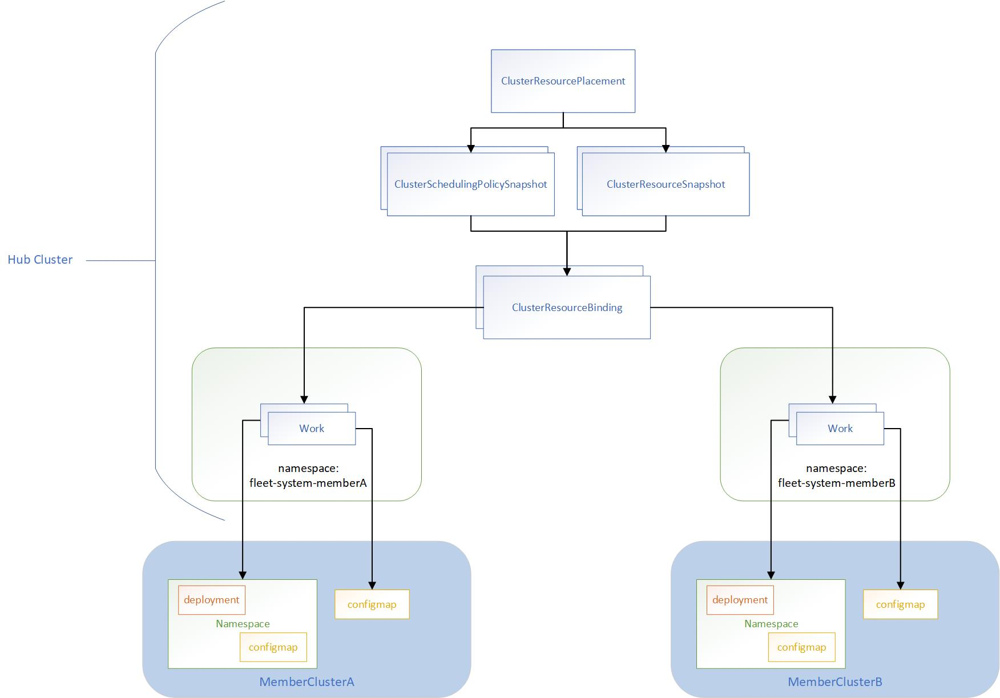
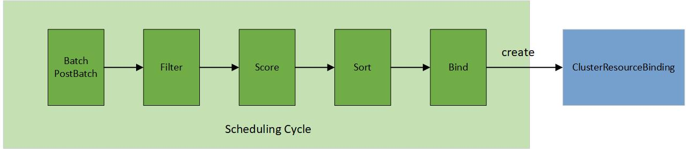

# ClusterResourcePlacement

## Overview

`ClusterResourcePlacement` concept is used to dynamically select cluster scoped resources (especially namespaces and all 
objects within it) and control how they are propagated to all or a subset of the member clusters.
A `ClusterResourcePlacement` mainly consists of three parts:
- **Resource selection**: select which cluster-scoped Kubernetes
resource objects need to be propagated from the hub cluster to selected member clusters. 
  
  It supports the following forms of resource selection:
  - Select resources by specifying just the <group, version, kind>. This selection propagates all resources with matching <group, version, kind>. 
  - Select resources by specifying the <group, version, kind> and name. This selection propagates only one resource that matches the <group, version, kind> and name. 
  - Select resources by specifying the <group, version, kind> and a set of labels using ClusterResourcePlacement -> LabelSelector. 
This selection propagates all resources that match the <group, version, kind> and label specified.

  **Note:** When a namespace is selected, all the namespace-scoped objects under this namespace are propagated to the 
selected member clusters along with this namespace.

- **Placement policy**: limit propagation of selected resources to a specific subset of member clusters.
  The following types of target cluster selection are supported:
    - **PickAll (Default)**: select any member clusters with matching cluster `Affinity` scheduling rules. If the `Affinity` 
is not specified, it will select all joined and healthy member clusters.
    - **PickFixed**: select a fixed list of member clusters defined in the `ClusterNames`.
    - **PickN**: select a `NumberOfClusters` of member clusters with optional matching cluster `Affinity` scheduling rules or topology spread constraints `TopologySpreadConstraints`.

- **Rollout strategy**: how to propagate new changes to the selected member clusters.

A simple `ClusterResourcePlacement` looks like this:

```yaml
apiVersion: placement.kubernetes-fleet.io/v1
kind: ClusterResourcePlacement
metadata:
  name: crp-1
spec:
  policy:
    placementType: PickN
    numberOfClusters: 2
    topologySpreadConstraints:
      - maxSkew: 1
        topologyKey: "env"
        whenUnsatisfiable: DoNotSchedule
  resourceSelectors:
    - group: ""
      kind: Namespace
      name: test-deployment
      version: v1
  revisionHistoryLimit: 100
  strategy:
    rollingUpdate:
      maxSurge: 25%
      maxUnavailable: 25%
      unavailablePeriodSeconds: 5
    type: RollingUpdate
```

## When To Use `ClusterResourcePlacement`

`ClusterResourcePlacement` is useful when you want for a general way of managing and running workloads across multiple clusters. 
Some example scenarios include the following:
-  As a platform operator, I want to place my cluster-scoped resources (especially namespaces and all objects within it) 
to a cluster that resides in the us-east-1.
-  As a platform operator, I want to spread my cluster-scoped resources (especially namespaces and all objects within it) 
evenly across the different regions/zones.
- As a platform operator, I prefer to place my test resources into the staging AKS cluster.
- As a platform operator, I would like to separate the workloads for compliance or policy reasons.
- As a developer, I want to run my cluster-scoped resources (especially namespaces and all objects within it) on 3 clusters. 
In addition, each time I update my workloads, the updates take place with zero downtime by rolling out to these three clusters incrementally.

## Placement Workflow



The placement controller will create `ClusterSchedulingPolicySnapshot` and `ClusterResourceSnapshot` snapshots by watching
the `ClusterResourcePlacement` object. So that it can trigger the scheduling and resource rollout process whenever needed.

The override controller will create the corresponding snapshots by watching the `ClusterResourceOverride` and `ResourceOverride`
which captures the snapshot of the overrides.

The placement workflow will be divided into several stages:
1. Scheduling: multi-cluster scheduler makes the schedule decision by creating  the `clusterResourceBinding` for a bundle
of resources based on the latest `ClusterSchedulingPolicySnapshot`generated by the `ClusterResourcePlacement`.
2. Rolling out resources: rollout controller applies the resources to the selected member clusters based on the rollout strategy.
3. Overriding: work generator applies the override rules defined by `ClusterResourceOverride` and `ResourceOverride` to 
the selected resources on the target clusters.
4. Creating or updating works:  work generator creates the work on the corresponding member cluster namespace. Each work
contains the (overridden) manifest workload to be deployed on the member clusters.
5. Applying resources on target clusters: apply work controller applies the manifest workload on the member clusters.
6. Checking resource availability: apply work controller checks the resource availability on the target clusters.

## Resource Selection

Resource selectors identify cluster-scoped objects to include based on standard Kubernetes identifiers - namely, the `group`, 
`kind`, `version`, and `name` of the object. Namespace-scoped objects are included automatically when the namespace they
are part of is selected. The example `ClusterResourcePlacement` above would include the `test-deployment` namespace and 
any objects that were created in that namespace.

The clusterResourcePlacement controller creates the `ClusterResourceSnapshot` to store a snapshot of selected resources
selected by the placement. The `ClusterResourceSnapshot` spec is immutable. Each time when the selected resources are updated,
the clusterResourcePlacement controller will detect the resource changes and create a new `ClusterResourceSnapshot`. It implies
that resources can change independently of any modifications to the `ClusterResourceSnapshot`. In other words, resource
changes can occur without directly affecting the `ClusterResourceSnapshot` itself.

The total amount of selected resources may exceed the 1MB limit for a single Kubernetes object. As a result, the controller 
may produce more than one `ClusterResourceSnapshot`s for all the selected resources.

`ClusterResourceSnapshot` sample:
```yaml
apiVersion: placement.kubernetes-fleet.io/v1
kind: ClusterResourceSnapshot
metadata:
  annotations:
    kubernetes-fleet.io/number-of-enveloped-object: "0"
    kubernetes-fleet.io/number-of-resource-snapshots: "1"
    kubernetes-fleet.io/resource-hash: e0927e7d75c7f52542a6d4299855995018f4a6de46edf0f814cfaa6e806543f3
  creationTimestamp: "2023-11-10T08:23:38Z"
  generation: 1
  labels:
    kubernetes-fleet.io/is-latest-snapshot: "true"
    kubernetes-fleet.io/parent-CRP: crp-1
    kubernetes-fleet.io/resource-index: "4"
  name: crp-1-4-snapshot
  ownerReferences:
  - apiVersion: placement.kubernetes-fleet.io/v1
    blockOwnerDeletion: true
    controller: true
    kind: ClusterResourcePlacement
    name: crp-1
    uid: 757f2d2c-682f-433f-b85c-265b74c3090b
  resourceVersion: "1641940"
  uid: d6e2108b-882b-4f6c-bb5e-c5ec5491dd20
spec:
  selectedResources:
  - apiVersion: v1
    kind: Namespace
    metadata:
      labels:
        kubernetes.io/metadata.name: test
      name: test
    spec:
      finalizers:
      - kubernetes
  - apiVersion: v1
    data:
      key1: value1
      key2: value2
      key3: value3
    kind: ConfigMap
    metadata:
      name: test-1
      namespace: test
```

## Placement Policy

`ClusterResourcePlacement` supports three types of policy as mentioned above. `ClusterSchedulingPolicySnapshot` will be
generated whenever policy changes are made to the `ClusterResourcePlacement` that require a new scheduling. Similar to
`ClusterResourceSnapshot`, its spec is immutable.

`ClusterSchedulingPolicySnapshot` sample:
```yaml
apiVersion: placement.kubernetes-fleet.io/v1
kind: ClusterSchedulingPolicySnapshot
metadata:
  annotations:
    kubernetes-fleet.io/CRP-generation: "5"
    kubernetes-fleet.io/number-of-clusters: "2"
  creationTimestamp: "2023-11-06T10:22:56Z"
  generation: 1
  labels:
    kubernetes-fleet.io/is-latest-snapshot: "true"
    kubernetes-fleet.io/parent-CRP: crp-1
    kubernetes-fleet.io/policy-index: "1"
  name: crp-1-1
  ownerReferences:
  - apiVersion: placement.kubernetes-fleet.io/v1
    blockOwnerDeletion: true
    controller: true
    kind: ClusterResourcePlacement
    name: crp-1
    uid: 757f2d2c-682f-433f-b85c-265b74c3090b
  resourceVersion: "1639412"
  uid: 768606f2-aa5a-481a-aa12-6e01e6adbea2
spec:
  policy:
    placementType: PickN
  policyHash: NDc5ZjQwNWViNzgwOGNmYzU4MzY2YjI2NDg2ODBhM2E4MTVlZjkxNGZlNjc1NmFlOGRmMGQ2Zjc0ODg1NDE2YQ==
status:
  conditions:
  - lastTransitionTime: "2023-11-06T10:22:56Z"
    message: found all the clusters needed as specified by the scheduling policy
    observedGeneration: 1
    reason: SchedulingPolicyFulfilled
    status: "True"
    type: Scheduled
  observedCRPGeneration: 5
  targetClusters:
  - clusterName: aks-member-1
    clusterScore:
      affinityScore: 0
      priorityScore: 0
    reason: picked by scheduling policy
    selected: true
  - clusterName: aks-member-2
    clusterScore:
      affinityScore: 0
      priorityScore: 0
    reason: picked by scheduling policy
    selected: true
```




In contrast to the original scheduler framework in Kubernetes, the multi-cluster scheduling process involves selecting a cluster for placement through a structured 5-step operation:
1. Batch & PostBatch
2. Filter 
3. Score
4. Sort
5. Bind

The _batch & postBatch_ step is to define the batch size according to the desired and current `ClusterResourceBinding`. 
The postBatch is to adjust the batch size if needed.

The _filter_ step finds the set of clusters where it's feasible to schedule the placement, for example, whether the cluster
is matching required `Affinity` scheduling rules specified in the `Policy`. It also filters out any clusters which are 
leaving the fleet or no longer connected to the fleet, for example, its heartbeat has been stopped for a prolonged period of time.

In the _score_ step (only applied to the pickN type), the scheduler assigns a score to each cluster that survived filtering.
Each cluster is given a topology spread score (how much a cluster would satisfy the topology spread
constraints specified by the user), and an affinity score (how much a cluster would satisfy the preferred affinity terms
specified by the user). 

In the _sort_ step (only applied to the pickN type), it sorts all eligible clusters by their scores, sorting first by topology 
spread score and breaking ties based on the affinity score.

The _bind_ step is to create/update/delete the `ClusterResourceBinding` based on the desired and current member cluster list.

## Rollout Strategy
Update strategy determines how changes to the `ClusterWorkloadPlacement` will be rolled out across member clusters. 
The only supported update strategy is `RollingUpdate` and it replaces the old placed resource using rolling update, i.e. 
gradually create the new one while replace the old ones.

## Placement status

After a `ClusterResourcePlacement` is created, details on current status can be seen by performing a `kubectl describe crp <name>`.
The status output will indicate both placement conditions and individual placement statuses on each member cluster that was selected.
The list of resources that are selected for placement will also be included in the describe output. 

Sample output:

```yaml
Name:         crp-1
Namespace:
Labels:       <none>
Annotations:  <none>
API Version:  placement.kubernetes-fleet.io/v1
Kind:         ClusterResourcePlacement
Metadata:
  ...
Spec:
  Policy:
    Placement Type:  PickAll
  Resource Selectors:
    Group:
    Kind:                  Namespace
    Name:                  application-1
    Version:               v1
  Revision History Limit:  10
  Strategy:
    Rolling Update:
      Max Surge:                   25%
      Max Unavailable:             25%
      Unavailable Period Seconds:  2
    Type:                          RollingUpdate
Status:
  Conditions:
    Last Transition Time:   2024-04-29T09:58:20Z
    Message:                found all the clusters needed as specified by the scheduling policy
    Observed Generation:    1
    Reason:                 SchedulingPolicyFulfilled
    Status:                 True
    Type:                   ClusterResourcePlacementScheduled
    Last Transition Time:   2024-04-29T09:58:20Z
    Message:                All 3 cluster(s) start rolling out the latest resource
    Observed Generation:    1
    Reason:                 RolloutStarted
    Status:                 True
    Type:                   ClusterResourcePlacementRolloutStarted
    Last Transition Time:   2024-04-29T09:58:20Z
    Message:                No override rules are configured for the selected resources
    Observed Generation:    1
    Reason:                 NoOverrideSpecified
    Status:                 True
    Type:                   ClusterResourcePlacementOverridden
    Last Transition Time:   2024-04-29T09:58:20Z
    Message:                Works(s) are succcesfully created or updated in the 3 target clusters' namespaces
    Observed Generation:    1
    Reason:                 WorkSynchronized
    Status:                 True
    Type:                   ClusterResourcePlacementWorkSynchronized
    Last Transition Time:   2024-04-29T09:58:20Z
    Message:                The selected resources are successfully applied to 3 clusters
    Observed Generation:    1
    Reason:                 ApplySucceeded
    Status:                 True
    Type:                   ClusterResourcePlacementApplied
    Last Transition Time:   2024-04-29T09:58:20Z
    Message:                The selected resources in 3 cluster are available now
    Observed Generation:    1
    Reason:                 ResourceAvailable
    Status:                 True
    Type:                   ClusterResourcePlacementAvailable
  Observed Resource Index:  0
  Placement Statuses:
    Cluster Name:  kind-cluster-1
    Conditions:
      Last Transition Time:  2024-04-29T09:58:20Z
      Message:               Successfully scheduled resources for placement in kind-cluster-1 (affinity score: 0, topology spread score: 0): picked by scheduling policy
      Observed Generation:   1
      Reason:                Scheduled
      Status:                True
      Type:                  Scheduled
      Last Transition Time:  2024-04-29T09:58:20Z
      Message:               Detected the new changes on the resources and started the rollout process
      Observed Generation:   1
      Reason:                RolloutStarted
      Status:                True
      Type:                  RolloutStarted
      Last Transition Time:  2024-04-29T09:58:20Z
      Message:               No override rules are configured for the selected resources
      Observed Generation:   1
      Reason:                NoOverrideSpecified
      Status:                True
      Type:                  Overridden
      Last Transition Time:  2024-04-29T09:58:20Z
      Message:               All of the works are synchronized to the latest
      Observed Generation:   1
      Reason:                AllWorkSynced
      Status:                True
      Type:                  WorkSynchronized
      Last Transition Time:  2024-04-29T09:58:20Z
      Message:               All corresponding work objects are applied
      Observed Generation:   1
      Reason:                AllWorkHaveBeenApplied
      Status:                True
      Type:                  Applied
      Last Transition Time:  2024-04-29T09:58:20Z
      Message:               The availability of work object crp-1-work is not trackable
      Observed Generation:   1
      Reason:                WorkNotTrackable
      Status:                True
      Type:                  Available
    Cluster Name:            kind-cluster-2
    Conditions:
      Last Transition Time:  2024-04-29T09:58:20Z
      Message:               Successfully scheduled resources for placement in kind-cluster-2 (affinity score: 0, topology spread score: 0): picked by scheduling policy
      Observed Generation:   1
      Reason:                Scheduled
      Status:                True
      Type:                  Scheduled
      Last Transition Time:  2024-04-29T09:58:20Z
      Message:               Detected the new changes on the resources and started the rollout process
      Observed Generation:   1
      Reason:                RolloutStarted
      Status:                True
      Type:                  RolloutStarted
      Last Transition Time:  2024-04-29T09:58:20Z
      Message:               No override rules are configured for the selected resources
      Observed Generation:   1
      Reason:                NoOverrideSpecified
      Status:                True
      Type:                  Overridden
      Last Transition Time:  2024-04-29T09:58:20Z
      Message:               All of the works are synchronized to the latest
      Observed Generation:   1
      Reason:                AllWorkSynced
      Status:                True
      Type:                  WorkSynchronized
      Last Transition Time:  2024-04-29T09:58:20Z
      Message:               All corresponding work objects are applied
      Observed Generation:   1
      Reason:                AllWorkHaveBeenApplied
      Status:                True
      Type:                  Applied
      Last Transition Time:  2024-04-29T09:58:20Z
      Message:               The availability of work object crp-1-work is not trackable
      Observed Generation:   1
      Reason:                WorkNotTrackable
      Status:                True
      Type:                  Available
    Cluster Name:            kind-cluster-3
    Conditions:
      Last Transition Time:  2024-04-29T09:58:20Z
      Message:               Successfully scheduled resources for placement in kind-cluster-3 (affinity score: 0, topology spread score: 0): picked by scheduling policy
      Observed Generation:   1
      Reason:                Scheduled
      Status:                True
      Type:                  Scheduled
      Last Transition Time:  2024-04-29T09:58:20Z
      Message:               Detected the new changes on the resources and started the rollout process
      Observed Generation:   1
      Reason:                RolloutStarted
      Status:                True
      Type:                  RolloutStarted
      Last Transition Time:  2024-04-29T09:58:20Z
      Message:               No override rules are configured for the selected resources
      Observed Generation:   1
      Reason:                NoOverrideSpecified
      Status:                True
      Type:                  Overridden
      Last Transition Time:  2024-04-29T09:58:20Z
      Message:               All of the works are synchronized to the latest
      Observed Generation:   1
      Reason:                AllWorkSynced
      Status:                True
      Type:                  WorkSynchronized
      Last Transition Time:  2024-04-29T09:58:20Z
      Message:               All corresponding work objects are applied
      Observed Generation:   1
      Reason:                AllWorkHaveBeenApplied
      Status:                True
      Type:                  Applied
      Last Transition Time:  2024-04-29T09:58:20Z
      Message:               The availability of work object crp-1-work is not trackable
      Observed Generation:   1
      Reason:                WorkNotTrackable
      Status:                True
      Type:                  Available
  Selected Resources:
    Kind:       Namespace
    Name:       application-1
    Version:    v1
    Kind:       ConfigMap
    Name:       app-config-1
    Namespace:  application-1
    Version:    v1
Events:
  Type    Reason                        Age    From                                   Message
  ----    ------                        ----   ----                                   -------
  Normal  PlacementRolloutStarted       3m46s  cluster-resource-placement-controller  Started rolling out the latest resources
  Normal  PlacementOverriddenSucceeded  3m46s  cluster-resource-placement-controller  Placement has been successfully overridden
  Normal  PlacementWorkSynchronized     3m46s  cluster-resource-placement-controller  Work(s) have been created or updated successfully for the selected cluster(s)
  Normal  PlacementApplied              3m46s  cluster-resource-placement-controller  Resources have been applied to the selected cluster(s)
  Normal  PlacementRolloutCompleted     3m46s  cluster-resource-placement-controller  Resources are available in the selected clusters
```

## Tolerations

Tolerations are a mechanism to allow the Fleet Scheduler to schedule resources to a `MemberCluster` that has specified on it.
We adopt the concept of [taints & tolerations](https://kubernetes.io/docs/concepts/scheduling-eviction/taint-and-toleration/) 
introduced in Kubernetes to the multi-cluster use case.

The `ClusterResourcePlacement` CR supports the specification of list of tolerations, which are applied to the `ClusterResourcePlacement`
object. Each Toleration object comprises the following fields:
- `key`: The key of the toleration.
- `value`: The value of the toleration.
- `effect`: The effect of the toleration, which can be `NoSchedule` for now.
- `operator`: The operator of the toleration, which can be `Exists` or `Equal`.

Each toleration is used to tolerate one or more specific taints applied on the `MemberCluster`. Once all taints on a `MemberCluster`
are tolerated by tolerations on a `ClusterResourcePlacement`, resources can be propagated to the `MemberCluster` by the scheduler for that
`ClusterResourcePlacement` resource.

Tolerations cannot be updated or removed from a `ClusterResourcePlacement`. If there is a need to update toleration a better approach is to
add another toleration. If we absolutely need to update or remove existing tolerations, the only option is to delete the existing `ClusterResourcePlacement`
and create a new object with the updated tolerations.

For detailed instructions, please refer to this [document](../../howtos/taint-toleration.md).

## Envelope Object

The `ClusterResourcePlacement` leverages the fleet hub cluster as a staging environment for customer resources. These resources are then propagated to member clusters that are part of the fleet, based on the `ClusterResourcePlacement` spec.

In essence, the objective is not to apply or create resources on the hub cluster for local use but to propagate these resources to other member clusters within the fleet.

Certain resources, when created or applied on the hub cluster, may lead to unintended side effects. These include:

- Validating/Mutating Webhook Configurations
- Cluster Role Bindings
- Resource Quotas
- Storage Classes
- Flow Schemas
- Priority Classes
- Ingress Classes
- Ingresses
- Network Policies

To address this, we support the use of `ConfigMap` with a fleet-reserved annotation. This allows users to encapsulate resources that might have side effects on the hub cluster within the `ConfigMap`. For detailed instructions, please refer to this [document](../../howtos/envelope-object.md).