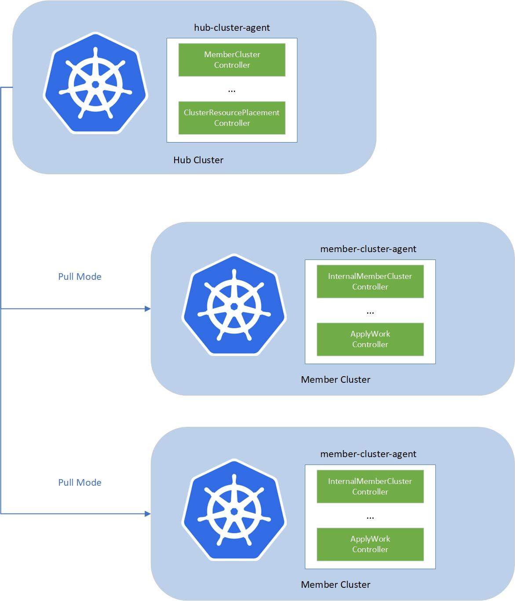

# Components

This document provides an overview of the components required for a fully functional and operational Fleet setup.

The fleet consists of the following components:
- fleet-hub-agent is a Kubernetes controller that create and reconciles all the fleet related CRs in the hub cluster.
- fleet-member-agent is a Kubernetes controller that create and reconciles all the fleet related CRs in the member cluster.
The fleet-member-agent is pulling the latest CRs from the hub cluster and consistently reconciles the member clusters to
the desired state.

The fleet implements agent-based pull mode. So that the working pressure can be distributed to the member clusters, and it
helps to breach the bottleneck of scalability, by dividing the load into each member cluster. On the other hand, hub
cluster does not need to directly access to the member clusters. Fleet can support the member clusters which only have 
the outbound network and no inbound network access.

To allow multiple clusters to run securely, fleet will create a reserved namespace to isolate the access permissions and
resources across multiple clusters.