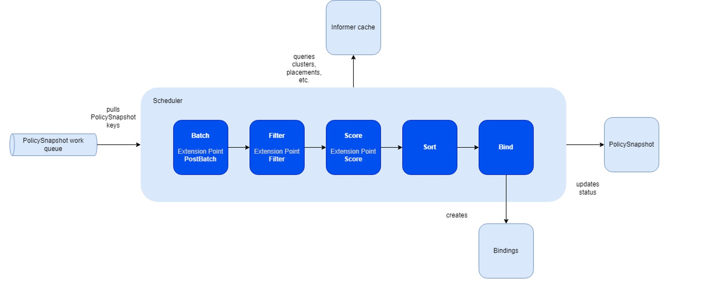

# Scheduling Framework

The fleet scheduling framework closely aligns with the native [Kubernetes scheduling framework](https://kubernetes.io/docs/concepts/scheduling-eviction/scheduling-framework/),
incorporating several modifications and tailored functionalities.

The primary advantage of this framework lies in its capability to compile plugins directly into the scheduler. Its API 
facilitates the implementation of diverse scheduling features as plugins, thereby ensuring a lightweight and maintainable
core. 

The fleet scheduler integrates three fundamental built-in plugin types:
* **Topology Spread Plugin**: Supports the TopologySpreadConstraints stipulated in the placement policy.
* **Cluster Affinity Plugin**: Facilitates the Affinity clause of the placement policy.
* **Same Placement Affinity Plugin**: Uniquely designed for the fleet, preventing multiple replicas (selected resources) from 
being placed within the same cluster. This distinguishes it from Kubernetes, which allows multiple pods on a node.
* **Cluster Eligibility Plugin**: Enables cluster selection based on specific status criteria.

Compared to the Kubernetes scheduling framework, the fleet framework introduces additional stages for the pickN placement type:

* **Batch & PostBatch**:
  * Batch: Defines the batch size based on the desired and current `ClusterResourceBinding`.
  * PostBatch: Adjusts the batch size as necessary. Unlike the Kubernetes scheduler, which schedules pods individually (batch size = 1).
* **Sort**:
  * Fleet's sorting mechanism selects a number of clusters, whereas Kubernetes' scheduler prioritizes nodes with the highest scores.

To streamline the scheduling framework, certain stages, such as `permit` and `reserve`, have been omitted due to the absence
of corresponding plugins or APIs enabling customers to reserve or permit clusters for specific placements. However, the
framework remains designed for easy extension in the future to accommodate these functionalities.

## In-tree plugins

The scheduler includes default plugins, each associated with distinct extension points:

| Plugin                       | PostBatch | Filter | Score |
|------------------------------|-----------|--------|-------|
| Cluster Affinity             | ❌         | ✅      | ✅     |
| Same Placement Anti-affinity | ❌         | ✅      | ❌     |
| Topology Spread Constraints  | ✅         | ✅      | ✅     |
| Cluster Eligibility          | ❌         | ✅      | ❌     |

The Cluster Affinity Plugin serves as an illustrative example and operates within the following extension points:
1. **PreFilter**:
Verifies whether the policy contains any required cluster affinity terms. If absent, the plugin bypasses the subsequent
Filter stage.
2. **Filter**:
Filters out clusters that fail to meet the specified required cluster affinity terms outlined in the policy.
3. **PreScore**:
Determines if the policy includes any preferred cluster affinity terms. If none are found, this plugin will be skipped
during the Score stage.
4. **Score**:
Assigns affinity scores to clusters based on compliance with the preferred cluster affinity terms stipulated in the policy.
