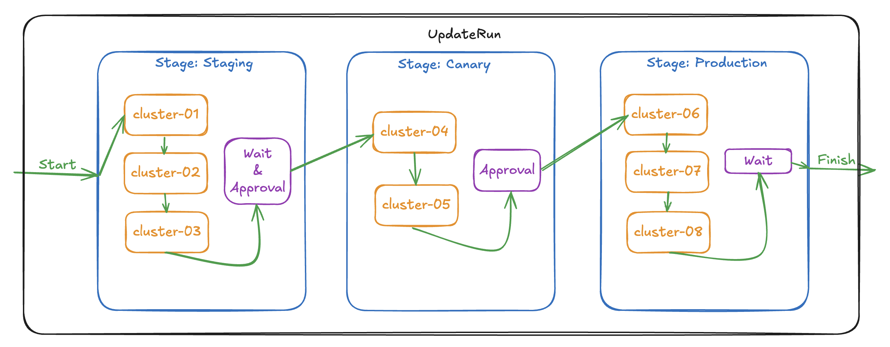

# Staged Update Run Rollout

While users rely on the `RollingUpdate` rollout strategy to safely roll out their workloads, 
there is also a requirement for a staged rollout mechanism at the cluster level to enable more controlled and systematic continuous delivery (CD) across the fleet.
Introducing a staged update run feature would address this need by enabling gradual deployments, reducing risk, and ensuring greater reliability and consistency in workload updates across clusters.



## Overview

We introduce two new Custom Resources, `ClusterStagedUpdateStrategy` and `ClusterStagedUpdateRun`. 

`ClusterStagedUpdateStrategy` defines a reusable orchestration pattern that organizes member clusters into distinct stages, controlling both the rollout sequence within each stage and incorporating post-stage validation tasks that must succeed before proceeding to subsequent stages. For brevity, we'll refer to `ClusterStagedUpdateStrategy` as _updateRun strategy_ throughout this document.

`ClusterStagedUpdateRun` orchestrates resource deployment across clusters by executing a `ClusterStagedUpdateStrategy`. It requires three key inputs: the target `ClusterResourcePlacement` name, a resource snapshot index specifying the version to deploy, and the strategy name that defines the rollout rules. The term _updateRun_ will be used to represent `ClusterStagedUpdateRun` in this document.

## Specify Rollout Strategy for ClusterResourcePlacement

While `ClusterResourcePlacement` uses `RollingUpdate` as its default strategy, switching to staged updates requires setting the rollout strategy to `External`:
```yaml
apiVersion: placement.kubernetes-fleet.io/v1beta1
kind: ClusterResourcePlacement
metadata:
  name: example-placement
spec:
  resourceSelectors:
    - group: ""
      kind: Namespace
      name: test-namespace
      version: v1
  policy:
    placementType: PickAll
    tolerations:
      - key: gpu-workload
        operator: Exists
  strategy:
    type: External # specify External here to use the stagedUpdateRun strategy.
```

## Deploy a ClusterStagedUpdateStrategy

The `ClusterStagedUpdateStrategy` custom resource enables users to organize member clusters into stages and define their rollout sequence. This strategy is reusable across multiple updateRuns, with each updateRun creating an immutable snapshot of the strategy at startup. This ensures that modifications to the strategy do not impact any in-progress updateRun executions.

An example `ClusterStagedUpdateStrategy` looks like below:
```yaml
apiVersion: placement.kubernetes-fleet.io/v1beta1
kind: ClusterStagedUpdateStrategy
metadata:
  name: example-strategy
spec:
  stages:
    - name: staging
      labelSelector:
        matchLabels:
          environment: staging
      afterStageTasks:
        - type: TimedWait
          waitTime: 1h
    - name: canary
      labelSelector:
        matchLabels:
          environment: canary
      afterStageTasks:
        - type: Approval
    - name: production
      labelSelector:
        matchLabels:
          environment: production
      sortingLabelKey: order
      afterStageTasks:
        - type: Approval
        - type: TimedWait
          waitTime: 1h
```

`ClusterStagedUpdateStrategy` is cluster-scoped resource. Its spec contains a list of `stageConfig` entries defining the configuration for each stage.
Stages execute sequentially in the order specified. Each stage must have a unique name and uses a labelSelector to identify member clusters for update. In above example, we define 3 stages: `staging` selecting member clusters labeled with `environment: staging`, `canary` selecting member clusters labeled with `environment: canary` and `production` selecting member clusters labeled with `environment: production`. 

Each stage can optionally specify `sortingLabelKey` and `afterStageTasks`. `sortingLabelKey` is used to define a label whose integer value determines update sequence within a stage. With above example, assuming there are 3 clusters selected in the `production` (all 3 clusters have `environment: production` label), then the fleet admin can label them with `order: 1`, `order: 2`, and `order: 3` respectively to control the rollout sequence. Without `sortingLabelKey`, clusters are updated in alphabetical order by name.

By default, the next stage begins immediately after the current stage completes. A user can control this cross-stage behavior by specifying the `afterStageTasks` in each stage. These tasks execute after all clusters in a stage update successfully. We currently support two types of tasks: `Approval` and `Timedwait`. Each stage can include one task of each type (maximum of two tasks). Both tasks must be satisfied before advancing to the next stage.

`Timedwait` task requires a specified waitTime duration. The updateRun waits for the duration to pass before executing the next stage. For `Approval` task, the controller generates a `ClusterApprovalRequest` object automatically named as `<updateRun name>-<stage name>`. The name is also shown in the updateRun status. The `ClusterApprovalRequest` object is pretty simple:
```yaml
apiVersion: placement.kubernetes-fleet.io/v1beta1
kind: ClusterApprovalRequest
metadata:
  name: example-run-canary
  labels:
    kubernetes-fleet.io/targetupdaterun: example-run
    kubernetes-fleet.io/targetUpdatingStage: canary
    kubernetes-fleet.io/isLatestUpdateRunApproval: "true"
spec:
  parentStageRollout: example-run
  targetStage: canary
```

The user then need to manually approve the task by patching its status:
```bash
kubectl patch clusterapprovalrequests example-run-canary --type='merge' -p '{"status":{"conditions":[{"type":"Approved","status":"True","reason":"lgtm","message":"lgtm","lastTransitionTime":"'$(date -u +%Y-%m-%dT%H:%M:%SZ)'","observedGeneration":1}]}}' --subresource=status
```
The updateRun will only continue to next stage after the `ClusterApprovalRequest` is approved.

## Trigger rollout with ClusterStagedUpdateRun

When using `External` rollout strategy, a `ClusterResourcePlacement` begins deployment only when triggered by a `ClusterStagedUpdateRun`. An example `ClusterStagedUpdateRun` is shown below:
```yaml
apiVersion: placement.kubernetes-fleet.io/v1beta1
kind: ClusterStagedUpdateRun
metadata:
  name: example-run
spec:
  placementName: example-placement
  resourceSnapshotIndex: "0"
  stagedRolloutStrategyName: example-strategy
```
This cluster-scoped resource requires three key parameters: the `placementName` specifying the target `ClusterResourcePlacement`, the `resourceSnapshotIndex` identifying which version of resources to deploy (learn how to find resourceSnapshotIndex [here](../../howtos/updaterun.md)), and the `stagedRolloutStrategyName` indicating the `ClusterStagedUpdateStrategy` to follow.

An updateRun executes in two phases. During the initialization phase, the controller performs a one-time setup where it captures a snapshot of the updateRun strategy, collects scheduled and to-be-deleted `ClusterResourceBindings`, generates the cluster update sequence, and records all this information in the updateRun status.

In the execution phase, the controller processes each stage sequentially, updates clusters within each stage one at a time, and enforces completion of after-stage tasks. It then executes a final delete stage to clean up resources from unscheduled clusters. The updateRun succeeds when all stages complete successfully. However, it will fail if any execution-affecting events occur, for example, the target ClusterResourcePlacement being deleted, and member cluster changes triggering new scheduling. In such cases, error details are recorded in the updateRun status. Remember that once initialized, an updateRun operates on its strategy snapshot, making it immune to subsequent strategy modifications.

## Understand ClusterStagedUpdateRun status

Let's take a deep look into the status of a completed `ClusterStagedUpdateRun`. It displays details about the rollout status for every clusters and stages.

```bash
$ kubectl describe crsur run example-run
...
Status:
  Conditions:
    Last Transition Time:  2025-03-12T23:21:39Z
    Message:               ClusterStagedUpdateRun initialized successfully
    Observed Generation:   1
    Reason:                UpdateRunInitializedSuccessfully
    Status:                True
    Type:                  Initialized
    Last Transition Time:  2025-03-12T23:21:39Z
    Message:               
    Observed Generation:   1
    Reason:                UpdateRunStarted
    Status:                True
    Type:                  Progressing
    Last Transition Time:  2025-03-12T23:26:15Z
    Message:               
    Observed Generation:   1
    Reason:                UpdateRunSucceeded
    Status:                True
    Type:                  Succeeded
  Deletion Stage Status:
    Clusters:
    Conditions:
      Last Transition Time:       2025-03-12T23:26:15Z
      Message:                    
      Observed Generation:        1
      Reason:                     StageUpdatingStarted
      Status:                     True
      Type:                       Progressing
      Last Transition Time:       2025-03-12T23:26:15Z
      Message:                    
      Observed Generation:        1
      Reason:                     StageUpdatingSucceeded
      Status:                     True
      Type:                       Succeeded
    End Time:                     2025-03-12T23:26:15Z
    Stage Name:                   kubernetes-fleet.io/deleteStage
    Start Time:                   2025-03-12T23:26:15Z
  Policy Observed Cluster Count:  2
  Policy Snapshot Index Used:     0
  Staged Update Strategy Snapshot:
    Stages:
      After Stage Tasks:
        Type:       Approval
        Wait Time:  0s
        Type:       TimedWait
        Wait Time:  1m0s
      Label Selector:
        Match Labels:
          Environment:  staging
      Name:             staging
      After Stage Tasks:
        Type:       Approval
        Wait Time:  0s
      Label Selector:
        Match Labels:
          Environment:    canary
      Name:               canary
      Sorting Label Key:  name
      After Stage Tasks:
        Type:       TimedWait
        Wait Time:  1m0s
        Type:       Approval
        Wait Time:  0s
      Label Selector:
        Match Labels:
          Environment:    production
      Name:               production
      Sorting Label Key:  order
  Stages Status:
    After Stage Task Status:
      Approval Request Name:  example-run-staging
      Conditions:
        Last Transition Time:  2025-03-12T23:21:54Z
        Message:               
        Observed Generation:   1
        Reason:                AfterStageTaskApprovalRequestCreated
        Status:                True
        Type:                  ApprovalRequestCreated
        Last Transition Time:  2025-03-12T23:22:55Z
        Message:               
        Observed Generation:   1
        Reason:                AfterStageTaskApprovalRequestApproved
        Status:                True
        Type:                  ApprovalRequestApproved
      Type:                    Approval
      Conditions:
        Last Transition Time:  2025-03-12T23:22:54Z
        Message:               
        Observed Generation:   1
        Reason:                AfterStageTaskWaitTimeElapsed
        Status:                True
        Type:                  WaitTimeElapsed
      Type:                    TimedWait
    Clusters:
      Cluster Name:  member1
      Conditions:
        Last Transition Time:  2025-03-12T23:21:39Z
        Message:               
        Observed Generation:   1
        Reason:                ClusterUpdatingStarted
        Status:                True
        Type:                  Started
        Last Transition Time:  2025-03-12T23:21:54Z
        Message:               
        Observed Generation:   1
        Reason:                ClusterUpdatingSucceeded
        Status:                True
        Type:                  Succeeded
    Conditions:
      Last Transition Time:  2025-03-12T23:21:54Z
      Message:               
      Observed Generation:   1
      Reason:                StageUpdatingWaiting
      Status:                False
      Type:                  Progressing
      Last Transition Time:  2025-03-12T23:22:55Z
      Message:               
      Observed Generation:   1
      Reason:                StageUpdatingSucceeded
      Status:                True
      Type:                  Succeeded
    End Time:                2025-03-12T23:22:55Z
    Stage Name:              staging
    Start Time:              2025-03-12T23:21:39Z
    After Stage Task Status:
      Approval Request Name:  example-run-canary
      Conditions:
        Last Transition Time:  2025-03-12T23:23:10Z
        Message:               
        Observed Generation:   1
        Reason:                AfterStageTaskApprovalRequestCreated
        Status:                True
        Type:                  ApprovalRequestCreated
        Last Transition Time:  2025-03-12T23:25:15Z
        Message:               
        Observed Generation:   1
        Reason:                AfterStageTaskApprovalRequestApproved
        Status:                True
        Type:                  ApprovalRequestApproved
      Type:                    Approval
    Clusters:
      Cluster Name:  member2
      Conditions:
        Last Transition Time:  2025-03-12T23:22:55Z
        Message:               
        Observed Generation:   1
        Reason:                ClusterUpdatingStarted
        Status:                True
        Type:                  Started
        Last Transition Time:  2025-03-12T23:23:10Z
        Message:               
        Observed Generation:   1
        Reason:                ClusterUpdatingSucceeded
        Status:                True
        Type:                  Succeeded
    Conditions:
      Last Transition Time:  2025-03-12T23:23:10Z
      Message:               
      Observed Generation:   1
      Reason:                StageUpdatingWaiting
      Status:                False
      Type:                  Progressing
      Last Transition Time:  2025-03-12T23:25:15Z
      Message:               
      Observed Generation:   1
      Reason:                StageUpdatingSucceeded
      Status:                True
      Type:                  Succeeded
    End Time:                2025-03-12T23:25:15Z
    Stage Name:              canary
    Start Time:              2025-03-12T23:22:55Z
    After Stage Task Status:
      Conditions:
        Last Transition Time:  2025-03-12T23:26:15Z
        Message:               
        Observed Generation:   1
        Reason:                AfterStageTaskWaitTimeElapsed
        Status:                True
        Type:                  WaitTimeElapsed
      Type:                    TimedWait
      Approval Request Name:   example-run-production
      Conditions:
        Last Transition Time:  2025-03-12T23:25:15Z
        Message:               
        Observed Generation:   1
        Reason:                AfterStageTaskApprovalRequestCreated
        Status:                True
        Type:                  ApprovalRequestCreated
        Last Transition Time:  2025-03-12T23:25:25Z
        Message:               
        Observed Generation:   1
        Reason:                AfterStageTaskApprovalRequestApproved
        Status:                True
        Type:                  ApprovalRequestApproved
      Type:                    Approval
    Clusters:
    Conditions:
      Last Transition Time:  2025-03-12T23:25:15Z
      Message:               
      Observed Generation:   1
      Reason:                StageUpdatingWaiting
      Status:                False
      Type:                  Progressing
      Last Transition Time:  2025-03-12T23:26:15Z
      Message:               
      Observed Generation:   1
      Reason:                StageUpdatingSucceeded
      Status:                True
      Type:                  Succeeded
    End Time:                2025-03-12T23:26:15Z
    Stage Name:              production
Events:                      <none>
```

### UpdateRun overall status

At the very top, `Status.Conditions` gives the overall status of the updateRun. The execution an update run consists of two phases: initialization and execution.
During initialization, the controller performs a one-time setup where it captures a snapshot of the updateRun strategy, collects scheduled and to-be-deleted `ClusterResourceBindings`,
generates the cluster update sequence, and records all this information in the updateRun status. 
The `UpdateRunInitializedSuccessfully` condition indicates the initialization is successful.

After initialization, the controller starts executing the updateRun. The `UpdateRunStarted` condition indicates the execution has started.

After all clusters are updated, all after-stage tasks are completed, and thus all stages are finished, the `UpdateRunSucceeded` condition is set to `True`, indicating the updateRun has succeeded.

### Fields recorded in the updateRun status during initialization

During initialization, the controller records the following fields in the updateRun status:
- `PolicySnapshotIndexUsed`: the index of the policy snapshot used for the updateRun, it should be the latest one.
- `PolicyObservedClusterCount`: the number of clusters selected by the scheduling policy.
- `StagedUpdateStrategySnapshot`: the snapshot of the updateRun strategy, which ensures any strategy changes will not affect executing updateRuns.

### Stages and clusters status

The `Stages Status` section displays the status of each stage and cluster. As shown in the strategy snapshot, the updateRun has three stages: `staging`, `canary`, and `production`. During initialization, the controller generates the rollout plan, classifies the scheduled clusters
into these three stages and dumps the plan into the updateRun status. As the execution progresses, the controller updates the status of each stage and cluster. Take the `staging` stage as an example, `member1` is included in this stage. `ClusterUpdatingStarted` condition indicates the cluster is being updated and `ClusterUpdatingSucceeded` condition shows the cluster is updated successfully. 

After all clusters are updated in a stage, the controller executes the specified after-stage tasks. Stage `staging` has two after-stage tasks: `Approval` and `TimedWait`. The `Approval` task requires the admin to manually approve a `ClusterApprovalRequest` generated by the controller. The name of the `ClusterApprovalRequest` is also included in the status, which is `example-run-staging`. `AfterStageTaskApprovalRequestCreated` condition indicates the approval request is created and `AfterStageTaskApprovalRequestApproved` condition indicates the approval request has been approved. The `TimedWait` task enforces a suspension of the rollout until the specified wait time has elapsed and in this case, the wait time is 1 minute. `AfterStageTaskWaitTimeElapsed` condition indicates the wait time has elapsed and the rollout can proceed to the next stage.

Each stage also has its own conditions. When a stage starts, the `Progressing` condition is set to `True`. When all the cluster updates complete, the `Progressing` condition is set to `False` with reason `StageUpdatingWaiting` as shown above. It means the stage is waiting for
after-stage tasks to pass.
And thus the `lastTransitionTime` of the `Progressing` condition also serves as the start time of the wait in case there's a `TimedWait` task. When all after-stage tasks pass, the `Succeeded` condition is set to `True`. Each stage status also has `Start Time` and `End Time` fields, making it easier to read.

There's also a `Deletion Stage Status` section, which displays the status of the deletion stage. The deletion stage is the last stage of the updateRun. It deletes resources from the unscheduled clusters. The status is pretty much the same as a normal update stage, except that there are no after-stage tasks.

Note that all these conditions have `lastTransitionTime` set to the time when the controller updates the status. It can help debug and check
the progress of the updateRun. 

## Relationship between ClusterStagedUpdateRun and ClusterResourcePlacement

A `ClusterStagedUpdateRun` serves as the trigger mechanism for rolling out a `ClusterResourcePlacement`. The key points of this relationship are:
* The `ClusterResourcePlacement` remains in a scheduled state without being deployed until a corresponding `ClusterStagedUpdateRun` is created.
* During rollout, the `ClusterResourcePlacement` status is continuously updated with detailed information from each target cluster.
* While a `ClusterStagedUpdateRun` only indicates whether updates have started and completed for each member cluster (as described in [previous section](#understand-clusterstagedupdaterun-status)), the `ClusterResourcePlacement` provides comprehensive details including:
  * Success/failure of resource creation
  * Application of overrides
  * Specific error messages

For example, below is the status of an in-progress `ClusterStagedUpdateRun`:
```bash
kubectl describe crsur example-run
Name:         example-run
...
Status:
  Conditions:
    Last Transition Time:  2025-03-17T21:37:14Z
    Message:               ClusterStagedUpdateRun initialized successfully
    Observed Generation:   1
    Reason:                UpdateRunInitializedSuccessfully
    Status:                True
    Type:                  Initialized
    Last Transition Time:  2025-03-17T21:37:14Z
    Message:               
    Observed Generation:   1
    Reason:                UpdateRunStarted # updateRun started
    Status:                True
    Type:                  Progressing
...
  Stages Status:
    After Stage Task Status:
      Approval Request Name:  example-run-staging
      Conditions:
        Last Transition Time:  2025-03-17T21:37:29Z
        Message:               
        Observed Generation:   1
        Reason:                AfterStageTaskApprovalRequestCreated
        Status:                True
        Type:                  ApprovalRequestCreated
      Type:                    Approval
      Conditions:
        Last Transition Time:  2025-03-17T21:38:29Z
        Message:               
        Observed Generation:   1
        Reason:                AfterStageTaskWaitTimeElapsed
        Status:                True
        Type:                  WaitTimeElapsed
      Type:                    TimedWait
    Clusters:
      Cluster Name:  member1
      Conditions:
        Last Transition Time:  2025-03-17T21:37:14Z
        Message:               
        Observed Generation:   1
        Reason:                ClusterUpdatingStarted
        Status:                True
        Type:                  Started
        Last Transition Time:  2025-03-17T21:37:29Z
        Message:               
        Observed Generation:   1
        Reason:                ClusterUpdatingSucceeded # member1 has updated successfully
        Status:                True
        Type:                  Succeeded
    Conditions:
      Last Transition Time:  2025-03-17T21:37:29Z
      Message:               
      Observed Generation:   1
      Reason:                StageUpdatingWaiting # waiting for approval
      Status:                False
      Type:                  Progressing
    Stage Name:              staging
    Start Time:              2025-03-17T21:37:14Z
    After Stage Task Status:
      Approval Request Name:  example-run-canary
      Type:                   Approval
    Clusters:
      Cluster Name:  member2
    Stage Name:      canary
    After Stage Task Status:
      Type:                   TimedWait
      Approval Request Name:  example-run-production
      Type:                   Approval
    Clusters:
    Stage Name:  production
...
```
In above status, member1 from stage `staging` has been updated successfully. The stage is waiting for approval to proceed to the next stage. And member2 from stage `canary` is not updated yet.

Let's take a look at the status of the `ClusterResourcePlacement` `example-placement`:
```bash
kubectl describe crp example-placement
Name:         example-placement
...
Status:
  Conditions:
    Last Transition Time:   2025-03-12T23:01:32Z
    Message:                found all cluster needed as specified by the scheduling policy, found 2 cluster(s)
    Observed Generation:    1
    Reason:                 SchedulingPolicyFulfilled
    Status:                 True
    Type:                   ClusterResourcePlacementScheduled
    Last Transition Time:   2025-03-13T07:35:25Z
    Message:                There are still 1 cluster(s) in the process of deciding whether to roll out the latest resources or not
    Observed Generation:    1
    Reason:                 RolloutStartedUnknown
    Status:                 Unknown
    Type:                   ClusterResourcePlacementRolloutStarted
  Observed Resource Index:  5
  Placement Statuses:
    Cluster Name:  member1
    Conditions:
      Last Transition Time:  2025-03-12T23:01:32Z
      Message:               Successfully scheduled resources for placement in "member1" (affinity score: 0, topology spread score: 0): picked by scheduling policy
      Observed Generation:   1
      Reason:                Scheduled
      Status:                True
      Type:                  Scheduled
      Last Transition Time:  2025-03-17T21:37:14Z
      Message:               Detected the new changes on the resources and started the rollout process, resourceSnapshotIndex: 5, clusterStagedUpdateRun: example-run
      Observed Generation:   1
      Reason:                RolloutStarted
      Status:                True
      Type:                  RolloutStarted
      Last Transition Time:  2025-03-17T21:37:14Z
      Message:               No override rules are configured for the selected resources
      Observed Generation:   1
      Reason:                NoOverrideSpecified
      Status:                True
      Type:                  Overridden
      Last Transition Time:  2025-03-17T21:37:14Z
      Message:               All of the works are synchronized to the latest
      Observed Generation:   1
      Reason:                AllWorkSynced
      Status:                True
      Type:                  WorkSynchronized
      Last Transition Time:  2025-03-17T21:37:14Z
      Message:               All corresponding work objects are applied
      Observed Generation:   1
      Reason:                AllWorkHaveBeenApplied
      Status:                True
      Type:                  Applied
      Last Transition Time:  2025-03-17T21:37:14Z
      Message:               All corresponding work objects are available
      Observed Generation:   1
      Reason:                AllWorkAreAvailable # member1 is all good
      Status:                True
      Type:                  Available
    Cluster Name:            member2
    Conditions:
      Last Transition Time:  2025-03-12T23:01:32Z
      Message:               Successfully scheduled resources for placement in "member2" (affinity score: 0, topology spread score: 0): picked by scheduling policy
      Observed Generation:   1
      Reason:                Scheduled
      Status:                True
      Type:                  Scheduled
      Last Transition Time:  2025-03-13T07:35:25Z
      Message:               In the process of deciding whether to roll out the latest resources or not
      Observed Generation:   1
      Reason:                RolloutStartedUnknown # member2 is not updated yet
      Status:                Unknown
      Type:                  RolloutStarted
...
```
In the `Placement Statuses` section, we can see the status of each member cluster. For member1, the `RolloutStarted` condition is set to `True`, indicating the rollout has started.
In the condition message, we print the `ClusterStagedUpdateRun` name, which is `example-run`. This indicates the most recent cluster update is triggered by `example-run`.
It also displays the detailed update status: the works are synced and applied and are detected available. As a comparison, member2 is still in `Scheduled` state only.

When troubleshooting a stalled updateRun, examining the `ClusterResourcePlacement` status offers valuable diagnostic information that can help identify the root cause. 
For comprehensive troubleshooting steps, refer to the [troubleshooting guide](../../troubleshooting/updaterun.md).

## Concurrent updateRuns

Multiple concurrent `ClusterStagedUpdateRun`s can be created for the same `ClusterResourcePlacement`, allowing fleet administrators to pipeline the rollout of different resource versions. However, to maintain consistency across the fleet and prevent member clusters from running different resource versions simultaneously, we enforce a key constraint: all concurrent `ClusterStagedUpdateRun`s must use identical `ClusterStagedUpdateStrategy` settings.

This strategy consistency requirement is validated during the initialization phase of each updateRun. This validation ensures predictable rollout behavior and prevents configuration drift across your cluster fleet, even when multiple updates are in progress.

## Next Steps
* Learn how to [rollout and rollback CRP resources with Staged Update Run](../../howtos/updaterun.md)
* Learn how to [troubleshoot a Staged Update Run](../../troubleshooting/updaterun.md)
