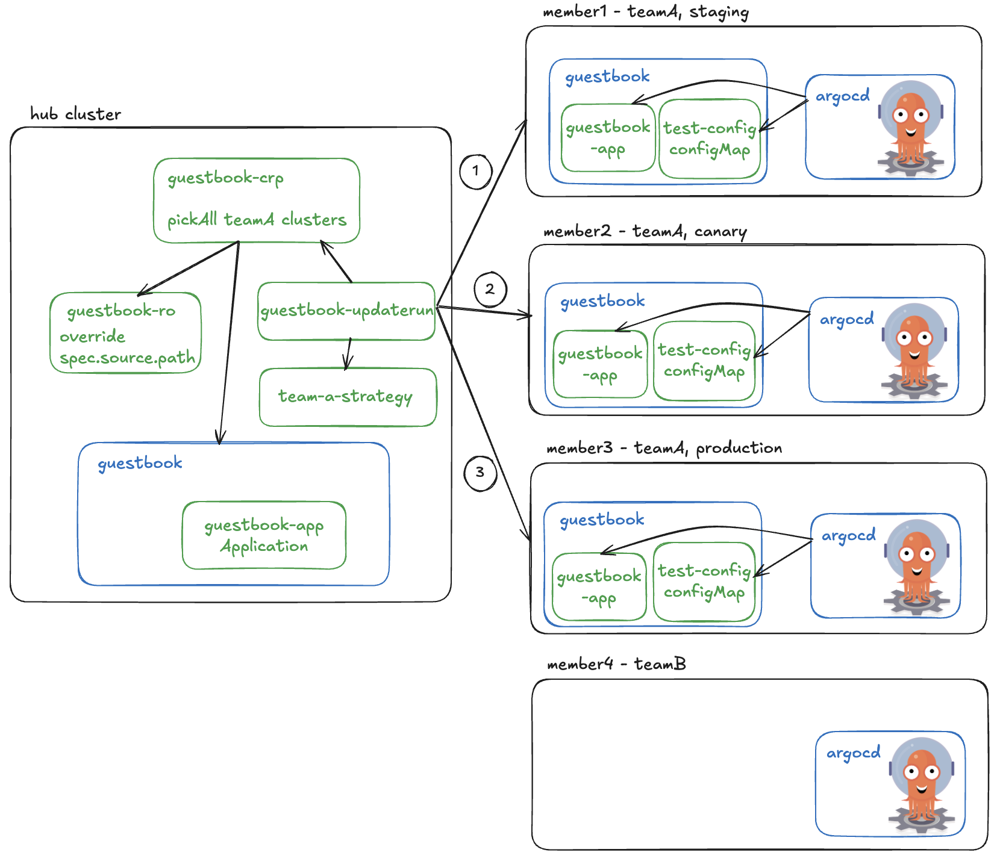

# Fleet and ArgoCD Integration

This hands-on guide of Fleet and ArgoCD integration shows how these powerful tools work in concert to revolutionize multi-cluster application management.
Discover how Fleet's intelligent orchestration capabilities complement ArgoCD's popular GitOps approach, enabling seamless deployments across diverse environments while maintaining consistency and control. 
This demo illuminates practical strategies for targeted deployments, environment-specific configurations, and safe, controlled rollouts. 
Follow along to transform your multi-cluster challenges into streamlined, automated workflows that enhance both developer productivity and operational reliability.

Suppose in a multi-cluster, multi-tenant organization, team A wants to deploy the resources ONLY to the clusters they own.
They want to make sure each cluster receives the correct configuration, and they want to ensure safe deployment by rolling out to their staging environment first, then to canary if staging is healthy, and lastly to the production.
Our demo will walk you through a hands-on experience of how to achieve this. Below image demonstrates the major components and their interactions.



## Prerequisites

### Fleet environment

In this demo, we prepare a fleet environment with one hub cluster and four member clusters.
The member clusters are labeled to indicate their environment and team ownership.
From the hub cluster, we can verify the clustermembership and their labels:
```bash
kubectl config use-context hub
kubectl get memberclusters --show-labels
NAME      JOINED   AGE    MEMBER-AGENT-LAST-SEEN   NODE-COUNT   AVAILABLE-CPU   AVAILABLE-MEMORY   LABELS
member1   True     84d    10s                      3            4036m           13339148Ki         environment=staging,team=A,...
member2   True     84d    14s                      3            4038m           13354748Ki         environment=canary,team=A,...
member3   True     144m   6s                       3            3676m           12458504Ki         environment=production,team=A,...
member4   True     6m7s   15s                      3            4036m           13347336Ki         team=B,...
```
From above output, we can see that:
- `member1` is in `staging` environment and owned by team `A`.
- `member2` is in `canary` environment and owned by team `A`.
- `member3` is in `production` environment and owned by team `A`.
- `member4` is owned by team `B`.

### Install ArgoCD

In this demo, we expect ArgoCD controllers to be installed on each member cluster. Only ArgoCD CRDs need to be installed on the hub cluster so that ArgoCD `Applications` can be created.

* **Option 1: Install ArgoCD on each member cluster directly (RECOMMENDED)**

  It's straightforward to install ArgoCD on each member cluster. You can follow the instructions in [ArgoCD Getting Started](https://argo-cd.readthedocs.io/en/stable/getting_started/).  
  To install only CRDs on the hub cluster, you can run the following command:
  ```bash
  kubectl config use-context hub
  kubectl apply -k https://github.com/argoproj/argo-cd/manifests/crds?ref=stable --server-side=true
  ```
* **Option 2: Use Fleet ClusterResourcePlacement (CRP) to install ArgoCD on member clusters (Experimental)**

  Alternatively, you can first install all the ArgoCD manifests on the hub cluster, and then use Fleet `ClusterResourcePlacement` to populate to the member clusters.
  Install the CRDs on the hub cluster:
  ```bash
  kubectl config use-context hub
  kubectl apply -k https://github.com/argoproj/argo-cd/manifests/crds?ref=stable --server-side=true
  ```
  Then apply the resource manifest we prepared at [./manifests/argocd-install.yaml](./manifests/argocd-install.yaml) to the hub cluster:
  ```bash
  kubectl config use-context hub
  kubectl create ns argocd && kubectl apply -f ./manifests/argocd-install.yaml -n argocd --server-side=true
  ```
  We then use a `ClusterResourcePlacement` (refer to [./manifests/argocd-crp.yaml](./manifests/argocd-crp.yaml)) to populate the manifests to the member clusters:
  ```bash
  kubectl config use-context hub
  kubectl apply -f ./manifests/argocd-crp.yaml
  ```
  Verify the CRP becomes available:
  ```bash
  kubectl get crp
  NAME                GEN   SCHEDULED   SCHEDULED-GEN   AVAILABLE   AVAILABLE-GEN   AGE
  crp-argocd          1     True        1               True        1               79m
  ```

### Enable "Applications in any namespace" in ArgoCD

In this demo, we are going to deploy an ArgoCD `Application` in the guestbook namespace.
Enabling "Applications in any namespace" feature, application teams can manage their applications in a more flexible way without the risk of a privilege escalation. In this demo, we need to enable `Applications` to be created in the `guestbook` namespace.

* **Option 1: Enable on each member cluster manually**
  
  You can follow the instructions in [ArgoCD Applications-in-any-namespace](https://argo-cd.readthedocs.io/en/latest/operator-manual/app-any-namespace/) documentation to enable this feature on each member cluster manually.   
  It generally involves updating the `argocd-cmd-params-cm` configmap and restarting the `argocd-application-controller` statefulset and `argocd-server` deployment.   
  You will also want to create an ArgoCD `AppProject` in the `argocd` namespace for `Applications` to refer to. You can find the manifest at [./manifests/guestbook-appproject.yaml](./manifests/guestbook-appproject.yaml).
  ```bash
  cat ./manifests/guestbook-appproject.yaml
  apiVersion: argoproj.io/v1alpha1
  kind: AppProject
  metadata:
    name: guestbook-project
    namespace: argocd
  spec:
    sourceNamespaces:
    - guestbook
    destinations:
    - namespace: '*'
      server: https://kubernetes.default.svc
    sourceRepos:
    - '*'

  kubectl config use-context member<*>
  kubectl apply -f ./manifests/guestbook-appproject.yaml
  ```
* **Option 2: Populate ArgoCD AppProject to member clusters with CRP (Experimental)**

  If you tried above Option 2 to install ArgoCD from hub cluster to member clusters, you gain the flexibility by just updating the `argocd-cmd-params-cm` configmap, and adding the [guestbook-appproject](./manifests/guestbook-appproject.yaml) to the `argocd` namespace, and [existing CRP](./manifests/argocd-crp.yaml) will populate the resources automatically to the member clusters. *Note: you probably also want to update the `argocd-application-controller` and `argocd-server` a bit to trigger pod restarts.*

## Deploy resources to clusters using ArgoCD Application orchestrated by Fleet

In [./manifests/guestbook/](./manifests/guestbook/) directory, we have prepared one test configmap for each member cluster.
The configmaps are same except for the `cluster` key in data pointing to the member cluster name. This simulates different configurations for different clusters.

### Deploy an ArgoCD Application for gitops continuous delivery

Team A want to create an ArgoCD `Application` to automatically sync the manifests from git repository to the member clusters.
The `Application` should be created on the hub cluster and placed onto the member clusters team A owns. The `Application` example can be found at [./manifests/guestbook-app.yaml](./manifests/guestbook-app.yaml).
```bash
kubectl config use-context hub
kubectl create ns guestbook
kubectl apply of - << EOF
apiVersion: argoproj.io/v1alpha1
kind: Application
metadata:
  name: guestbook-app
  namespace: guestbook 
spec:
  destination:
    namespace: guestbook
    server: https://kubernetes.default.svc
  project: guestbook-project
  source:
    path: docs/demos/ArgoCD/manifests/guestbook
    repoURL: https://github.com/Azure/fleet.git
    targetRevision: master
  syncPolicy:
    automated:
      prune: true
      selfHeal: true
    retry:
      backoff:
        duration: 5s
        factor: 2
        maxDuration: 3m0s
      limit: 10
    syncOptions:
    - PruneLast=true
    - PrunePropagationPolicy=foreground
    - CreateNamespace=true
    - ApplyOutOfSyncOnly=true
EOF
```

### Place ArgoCD Application to member clusters with CRP

A `ClusterResourcePlacement` (CRP) is used to place resources on the hub cluster to member clusters.
Team A is able to select their own member clusters by specifying cluster labels. 
In `spec.resourceSelectors`, specifying `guestbook` namespace includes all resources in it including the `Application` just deployed.
The `spec.strategy.type` is set to `External` so that CRP is not rolled out immediately. Instead, rollout will be triggered separately in next steps.
The CRP resource can be found at [./manifests/guestbook-crp.yaml](./manifests/guestbook-crp.yaml).
```bash
kubectl config use-context hub
kubectl apply -f - << EOF
apiVersion: placement.kubernetes-fleet.io/v1beta1
kind: ClusterResourcePlacement
metadata:
  name: guestbook-crp
spec:
  policy:
    placementType: PickAll # select all member clusters with label team=A
    affinity:
      clusterAffinity:
        requiredDuringSchedulingIgnoredDuringExecution:
          clusterSelectorTerms:
            - labelSelector:
                matchLabels:
                  team: A # label selectors
  resourceSelectors:
  - group: ""
    kind: Namespace
    name: guestbook # select guestbook namespace with all resources in it
    version: v1
  revisionHistoryLimit: 10
  strategy:
    type: External # will use an updateRun to trigger the rollout
EOF
```

Verify the CRP status and it's clear that only `member1`, `member2`, and `member3` are selected with `team=A` label are selected, and rollout has not started yet.
```bash
kubectl get crp guestbook-crp -o yaml
...
status:
  conditions:
  - lastTransitionTime: "2025-03-23T23:46:56Z"
    message: found all cluster needed as specified by the scheduling policy, found
      3 cluster(s)
    observedGeneration: 1
    reason: SchedulingPolicyFulfilled
    status: "True"
    type: ClusterResourcePlacementScheduled
  - lastTransitionTime: "2025-03-23T23:46:56Z"
    message: There are still 3 cluster(s) in the process of deciding whether to roll
      out the latest resources or not
    observedGeneration: 1
    reason: RolloutStartedUnknown
    status: Unknown
    type: ClusterResourcePlacementRolloutStarted
  observedResourceIndex: "0"
  placementStatuses:
  - clusterName: member1
    conditions:
    - lastTransitionTime: "2025-03-24T00:22:22Z"
      message: 'Successfully scheduled resources for placement in "member1" (affinity
        score: 0, topology spread score: 0): picked by scheduling policy'
      observedGeneration: 1
      reason: Scheduled
      status: "True"
      type: Scheduled
    - lastTransitionTime: "2025-03-24T00:22:22Z"
      message: In the process of deciding whether to roll out the latest resources
        or not
      observedGeneration: 1
      reason: RolloutStartedUnknown
      status: Unknown
      type: RolloutStarted
  - clusterName: member2
    conditions:
    - lastTransitionTime: "2025-03-23T23:46:56Z"
      message: 'Successfully scheduled resources for placement in "member2" (affinity
        score: 0, topology spread score: 0): picked by scheduling policy'
      observedGeneration: 1
      reason: Scheduled
      status: "True"
      type: Scheduled
    - lastTransitionTime: "2025-03-23T23:46:56Z"
      message: In the process of deciding whether to roll out the latest resources
        or not
      observedGeneration: 1
      reason: RolloutStartedUnknown
      status: Unknown
      type: RolloutStarted
  - clusterName: member3
    conditions:
    - lastTransitionTime: "2025-03-23T23:46:56Z"
      message: 'Successfully scheduled resources for placement in "member3" (affinity
        score: 0, topology spread score: 0): picked by scheduling policy'
      observedGeneration: 1
      reason: Scheduled
      status: "True"
      type: Scheduled
    - lastTransitionTime: "2025-03-23T23:46:56Z"
      message: In the process of deciding whether to roll out the latest resources
        or not
      observedGeneration: 1
      reason: RolloutStartedUnknown
      status: Unknown
      type: RolloutStarted
...
```

### Override path for different member clusters with ResourceOverride

Above `Application` specifies `spec.source.path` as `docs/demos/ArgoCD/manifests/guestbook`.
By default, every member cluster selected receives the same `Application` resource.
In this demo, different member clusters should receive different manifests, as configured in different folders in the git repo.
To achieve this, a `ResourceOverride` is used to override the `Application` resource for each member cluster.
The `ResourceOverride` resource can be found at [./manifests/guestbook-ro.yaml](./manifests/guestbook-ro.yaml).
```bash
kubectl config use-context hub
kubectl apply -f - << EOF
apiVersion: placement.kubernetes-fleet.io/v1alpha1
kind: ResourceOverride
metadata:
  name: guestbook-app-ro
  namespace: guestbook # ro needs to be created in the same namespace as the resource it overrides
spec:
  placement:
    name: guestbook-crp # specify the CRP name
  policy:
    overrideRules:
    - clusterSelector:
        clusterSelectorTerms:
        - labelSelector: {} # empty labelSelector selected all member clusters
      jsonPatchOverrides:
      - op: replace
        path: /spec/source/path # spec.source.path is overridden
        value: "docs/demos/ArgoCD/manifests/guestbook/${MEMBER-CLUSTER-NAME}" # ${MEMBER-CLUSTER-NAME} is replaced with the member cluster name
      overrideType: JSONPatch
  resourceSelectors:
  - group: argoproj.io
    kind: Application
    name: guestbook-app # name of the Application
    version: v1alpha1
EOF
```

### Trigger CRP progressive rollout with clusterStagedUpdateRun

A `ClusterStagedUpdateRun` (or updateRun for short) is used to trigger the rollout of the CRP in a progressive, stage-by-stage manner by following a pre-defined rollout strategy, namely `ClusterStagedUpdateStrategy`.

A `ClusterStagedUpdateStrategy` is provided at [./manifests/teamA-strategy.yaml](./manifests/teamA-strategy.yaml). 
It defines 3 stages: staging, canary, and production. Clusters are grouped by label `environment` into different stages. 
The `TimedWait` after-stage task in `staging` stageis used to pause the rollout for 1 minute before moving to `canary` stage.s
The `Approval` after-stage task in `canary` stage waits for manual approval before moving to `production` stage.
After applying the strategy, a `ClusterStagedUpdateRun` can then reference it to generate the concrete test plan.
```bash
kubectl config use-context hub
kubectl apply -f - << EOF
apiVersion: placement.kubernetes-fleet.io/v1beta1
kind: ClusterStagedUpdateStrategy
metadata:
  name: team-a-strategy
spec:
  stages: # 3 stages: staging, canary, production
  - afterStageTasks:
    - type: TimedWait
      waitTime: 1m # wait 1 minute before moving to canary stage
    labelSelector:
      matchLabels:
        environment: staging
    name: staging
  - afterStageTasks:
    - type: Approval # wait for manual approval before moving to production stage
    labelSelector:
      matchLabels:
        environment: canary
    name: canary
  - labelSelector:
      matchLabels:
        environment: production
    name: production
EOF
```

Now it's time to trigger the rollout. A sample `ClusterStagedUpdateRun` can be found at [./manifests/guestbook-updaterun.yaml](./manifests/guestbook-updaterun.yaml).
It's pretty straightforward, just specifying the CRP resource name, the strategy name, and resource version.
```bash
kubectl config use-context hub
kubectl apply -f - << EOF
apiVersion: placement.kubernetes-fleet.io/v1beta1
kind: ClusterStagedUpdateRun
metadata:
  name: guestbook-updaterun
spec:
  placementName: guestbook-crp
  resourceSnapshotIndex: "0"
  stagedRolloutStrategyName: team-a-strategy
EOF
```

Checking the updateRun status to see the rollout progress, `member1` in `staging` stage has been updated, and it's pausing at the `after-stage` task before moving to `canary` stage.
```bash
kubectl config use-context hub
kubectl get crsur gestbook-updaterun -o yaml
...
stagesStatus:
  - afterStageTaskStatus:
    - type: TimedWait
    clusters:
    - clusterName: member1
      conditions:
      - lastTransitionTime: "2025-03-24T00:47:41Z"
        message: ""
        observedGeneration: 1
        reason: ClusterUpdatingStarted
        status: "True"
        type: Started
      - lastTransitionTime: "2025-03-24T00:47:56Z"
        message: ""
        observedGeneration: 1
        reason: ClusterUpdatingSucceeded
        status: "True"
        type: Succeeded
      resourceOverrideSnapshots:
      - name: guestbook-app-ro-0
        namespace: guestbook
    conditions:
    - lastTransitionTime: "2025-03-24T00:47:56Z"
      message: ""
      observedGeneration: 1
      reason: StageUpdatingWaiting
      status: "False"
      type: Progressing
    stageName: staging
    startTime: "2025-03-24T00:47:41Z"
  - afterStageTaskStatus:
    - approvalRequestName: guestbook-updaterun-canary
      type: Approval
    clusters:
    - clusterName: member2
      resourceOverrideSnapshots:
      - name: guestbook-app-ro-0
        namespace: guestbook
    stageName: canary
  - clusters:
    - clusterName: member3
      resourceOverrideSnapshots:
      - name: guestbook-app-ro-0
        namespace: guestbook
    stageName: production
...
```

Checking the `Application` status on each member cluster, and it's synced and healthy:
```bash
kubectl config use-context member1
kubectl get Applications -n guestbook
NAMESPACE   NAME            SYNC STATUS   HEALTH STATUS
guestbook   guestbook-app   Synced        Healthy
```
At the same time, there's no `Application` in `member2` or `member3` as they are not rolled out yet.

After 1 minute, the `staging` stage is completed, and `member2` in `canary` stage is updated.
```bash
kubectl config use-context hub
kubectl get crsur guestbook-updaterun -o yaml
...
- afterStageTaskStatus:
    - approvalRequestName: guestbook-updaterun-canary
      conditions:
      - lastTransitionTime: "2025-03-24T00:49:11Z"
        message: ""
        observedGeneration: 1
        reason: AfterStageTaskApprovalRequestCreated
        status: "True"
        type: ApprovalRequestCreated
      type: Approval
    clusters:
    - clusterName: member2
      conditions:
      - lastTransitionTime: "2025-03-24T00:48:56Z"
        message: ""
        observedGeneration: 1
        reason: ClusterUpdatingStarted
        status: "True"
        type: Started
      - lastTransitionTime: "2025-03-24T00:49:11Z"
        message: ""
        observedGeneration: 1
        reason: ClusterUpdatingSucceeded
        status: "True"
        type: Succeeded
      resourceOverrideSnapshots:
      - name: guestbook-app-ro-0
        namespace: guestbook
    conditions:
    - lastTransitionTime: "2025-03-24T00:49:11Z"
      message: ""
      observedGeneration: 1
      reason: StageUpdatingWaiting
      status: "False"
      type: Progressing
    stageName: canary
    startTime: "2025-03-24T00:48:56Z"
...
```
`canary` stage requires manual approval to complete. The controller generates a `ClusterApprovalRequest` object for user to approve.
The name is included in the updateRun status, as shown above, `approvalRequestName: guestbook-updaterun-canary`.
Team A can verify everything works properly and then approve the request to proceed to `production` stage:
```bash
kubectl config use-context hub

kubectl get clusterapprovalrequests
NAME                         UPDATE-RUN            STAGE    APPROVED   APPROVALACCEPTED   AGE
guestbook-updaterun-canary   guestbook-updaterun   canary                                 21m

kubectl patch clusterapprovalrequests guestbook-updaterun-canary --type='merge' -p '{"status":{"conditions":[{"type":"Approved","status":"True","reason":"lgtm","message":"lgtm","lastTransitionTime":"'$(date -u +%Y-%m-%dT%H:%M:%SZ)'","observedGeneration":1}]}}' --subresource=status

kubectl get clusterapprovalrequests
NAME                         UPDATE-RUN            STAGE    APPROVED   APPROVALACCEPTED   AGE
guestbook-updaterun-canary   guestbook-updaterun   canary   True       True               22m
```

Not the updateRun moves on to `production` stage, and `member3` is updated. The whole updateRun is completed:
```bash
kubectl config use-context hub

kubectl get crsur guestbook-updaterun -o yaml
...
status:
  conditions:
  - lastTransitionTime: "2025-03-24T00:47:41Z"
    message: ClusterStagedUpdateRun initialized successfully
    observedGeneration: 1
    reason: UpdateRunInitializedSuccessfully
    status: "True"
    type: Initialized
  - lastTransitionTime: "2025-03-24T00:47:41Z"
    message: ""
    observedGeneration: 1
    reason: UpdateRunStarted
    status: "True"
    type: Progressing
  - lastTransitionTime: "2025-03-24T01:11:45Z"
    message: ""
    observedGeneration: 1
    reason: UpdateRunSucceeded
    status: "True"
    type: Succeeded
...
  stagesStatus:
  ...
  - clusters:
    - clusterName: member3
      conditions:
      - lastTransitionTime: "2025-03-24T01:11:30Z"
        message: ""
        observedGeneration: 1
        reason: ClusterUpdatingStarted
        status: "True"
        type: Started
      - lastTransitionTime: "2025-03-24T01:11:45Z"
        message: ""
        observedGeneration: 1
        reason: ClusterUpdatingSucceeded
        status: "True"
        type: Succeeded
      resourceOverrideSnapshots:
      - name: guestbook-app-ro-0
        namespace: guestbook
    conditions:
    - lastTransitionTime: "2025-03-24T01:11:45Z"
      message: ""
      observedGeneration: 1
      reason: StageUpdatingWaiting
      status: "False"
      type: Progressing
    - lastTransitionTime: "2025-03-24T01:11:45Z"
      message: ""
      observedGeneration: 1
      reason: StageUpdatingSucceeded
      status: "True"
      type: Succeeded
    endTime: "2025-03-24T01:11:45Z"
    stageName: production
    startTime: "2025-03-24T01:11:30Z"
...
```

### Verify the Application on member clusters

Now we are able to see the `Application` is created, synced, and healthy on all member clusters except `member4` as it does not belong to team A.
We can also verify that the configMaps synced from git repo are different for each member cluster:
```bash
kubectl config use-context member1
kubectl get app -n guestbook
NAMESPACE   NAME            SYNC STATUS   HEALTH STATUS
guestbook   guestbook-app   Synced        Healthy

kubectl get cm -n guestbook test-config -o yaml
apiVersion: v1
data:
  branch: master
  cluster: member1 # <- member1 exclusive
kind: ConfigMap
metadata:
  ...
  name: test-config
  namespace: guestbook

# verify member2
kubectl config use-context member2
kubectl get app -n guestbook
NAMESPACE   NAME            SYNC STATUS   HEALTH STATUS
guestbook   guestbook-app   Synced        Healthy

kubectl get cm -n guestbook test-config -o yaml
apiVersion: v1
data:
  branch: master
  cluster: member2 # <- member2 exclusive
kind: ConfigMap
metadata:
  ...
  name: test-config
  namespace: guestbook

# verify member3
kubectl config use-context member3
kubectl get app -n guestbook
NAMESPACE   NAME            SYNC STATUS   HEALTH STATUS
guestbook   guestbook-app   Synced        Healthy

kubectl get cm -n guestbook test-config -o yaml
apiVersion: v1
data:
  branch: master
  cluster: member3 # <- member3 exclusive
kind: ConfigMap
metadata:
  ...
  name: test-config
  namespace: guestbook

# verify member4
kubectl config use-context member4
kubectl get app -A
No resources found
```

## Release a new version

When team A makes some changes and decides to release a new version, they can cut a new branch or tag in the git repo.
To rollout this new version progressively, they can simply:
1. Update the `targetRevision` in the `Application` resource to the new branch or tag.
2. Create a new `ClusterStagedUpdateRun` with the new resource snapshot index.

In our repo, we have prepared a new branch `argocd-demo` to simulate a new release.
Updating the `spec.source.targetRevision` in the `Application` resource to `argocd-demo` will not trigger rollout instantly.
```bash
kubectl config use-context hub
kubectl edit app guestbook-app -n guestbook
...
spec:
  source:
    targetRevision: argocd-demo
...
```

Checking the crp, and it's clear that the new `Application` is not available yet:
```bash
kubectl config use-context hub
kubectl get crp
NAME            GEN   SCHEDULED   SCHEDULED-GEN   AVAILABLE   AVAILABLE-GEN   AGE
guestbook-crp   1     True        1                                           130m
```

Check a new version of `ClusterResourceSnapshot` is generated:
```bash
kubectl config use-context hub
kubectl get clusterresourcesnapshots --show-labels
NAME                       GEN   AGE     LABELS
guestbook-crp-0-snapshot   1     133m    kubernetes-fleet.io/is-latest-snapshot=false,kubernetes-fleet.io/parent-CRP=guestbook-crp,kubernetes-fleet.io/resource-index=0
guestbook-crp-1-snapshot   1     3m46s   kubernetes-fleet.io/is-latest-snapshot=true,kubernetes-fleet.io/parent-CRP=guestbook-crp,kubernetes-fleet.io/resource-index=1
```
Notice that `guestbook-crp-1-snapshot` is latest with `resource-index` set to `1`.

Create a new `ClusterStagedUpdateRun` with the new resource snapshot index:
```bash
kubectl config use-context hub
kubectl apply -f - << EOF
apiVersion: placement.kubernetes-fleet.io/v1beta1
kind: ClusterStagedUpdateRun
metadata:
  name: guestbook-updaterun
spec:
  placementName: guestbook-crp
  resourceSnapshotIndex: "1"
  stagedRolloutStrategyName: team-a-strategy
EOF
```

Following the same steps as before, we can see the new version is rolled out progressively to all member clusters.
Checking `member1` (and same for `member2` and `member3`), we can see the data in the configMap is updated:
```bash
kubectl config use-context member1
kubectl get cm -n guestbook test-config -o yaml
...
data:
  branch: argocd-demo # <- new branch updated here
  cluster: member1
```

## Summary

Fleet and ArgoCD integration offers a powerful solution for multi-cluster application management, combining Fleet's intelligent orchestration with ArgoCD's popular GitOps approach. This demo showcased how teams can deploy applications across diverse environments with cluster-specific configurations while maintaining complete control over the rollout process. Through practical examples, we demonstrated targeted deployments using cluster labels, environment-specific configurations via overrides, and safe, controlled rollouts with staged update runs. This integration enables teams to transform multi-cluster challenges into streamlined, automated workflows that enhance both developer productivity and operational reliability.

## Next steps
* Learn more about [ClusterResourcePlacements](../../concepts/ClusterResourcePlacement/README.md).
* Learn more about [ClusterResourceOverrides and ResourceOverrides](../../concepts/Override/README.md).
* Learn more about [ClusterStagedUpdateRun](../../concepts/StagedUpdateRun/README.md).
